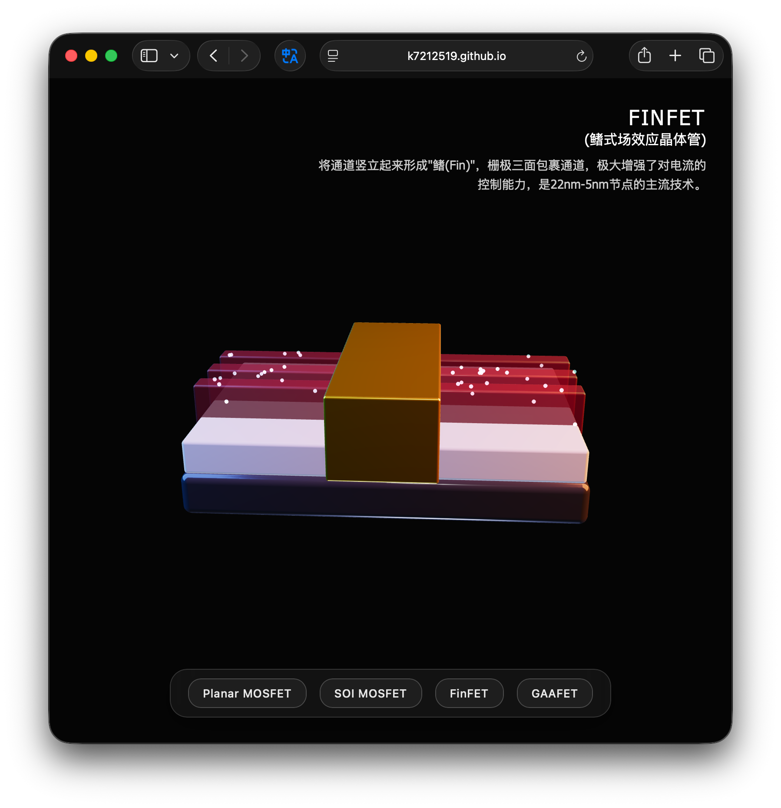
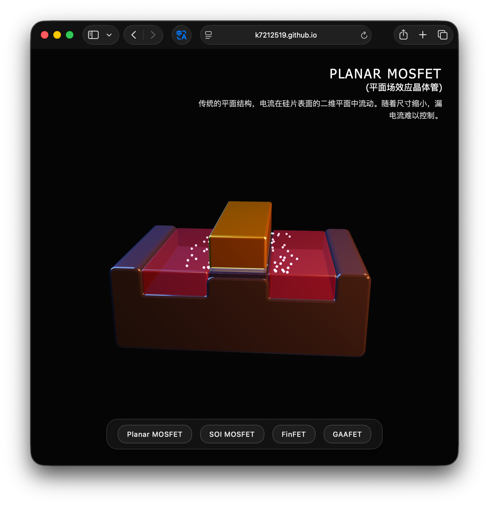
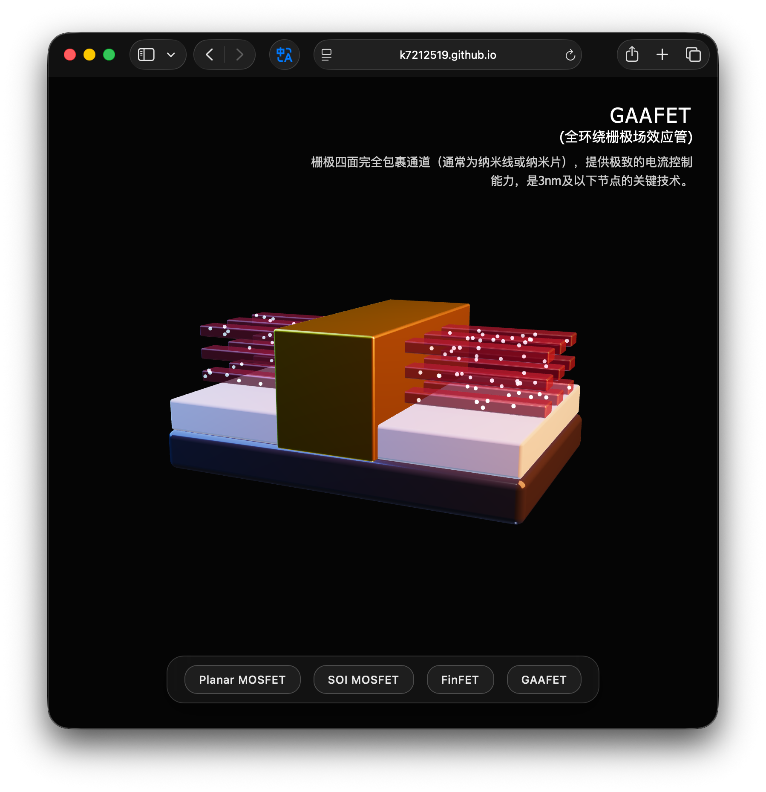

# MOSFET/FinFET/GAAFET 3D Transistor Visualizer

[English](#english) | [中文](#中文)

## English

An interactive 3D transistor structure visualizer built with Three.js. It supports four structures: Planar MOSFET, SOI MOSFET, FinFET, and GAAFET.

### Screenshots

#### FinFET 3D Structure


#### Other Structures



### Project Structure

```
.
├── index.html              # Main HTML (UI and styles)
├── js/
│   ├── main.js            # Entry (scene init, lighting, animation loop)
│   ├── materials.js       # Materials (PBR)
│   ├── particles.js       # Particle system (electron flow demo)
│   └── models.js          # Model generators (4 transistor structures)
├── assets/
└── README.md              # Project documentation
```

### Features

- **Four transistor structures**: Planar MOSFET, SOI MOSFET, FinFET, GAAFET
- **Electron flow animation**: visualize current paths
- **High-quality rendering**: PBR materials, rounded geometry, real-time shadows
- **Responsive UI**: works on desktop and mobile
- **URL parameters**: open a specific model via `?type=1/2/3/4`
- **Language switch**: bilingual UI, supports `?lang=zh|en`

### Usage

1. Open `index.html` directly or serve it via a local server
2. Use the bottom buttons to switch structures
3. Drag to rotate, scroll to zoom

### URL Parameters

- `index.html?type=1` - Planar MOSFET
- `index.html?type=2` - SOI MOSFET
- `index.html?type=3` - FinFET
- `index.html?type=4` - GAAFET
- `index.html?lang=zh` - 中文
- `index.html?lang=en` - English

### Tech Stack

- Three.js (r160)
- ES6 Modules
- WebGL / PBR rendering

## 中文

使用 Three.js 开发的交互式 3D 晶体管结构可视化工具，支持 Planar MOSFET、SOI MOSFET、FinFET 和 GAAFET 四种结构。

### 项目结构

```
.
├── index.html              # 主HTML文件（UI和样式）
├── js/
│   ├── main.js            # 主程序入口（场景初始化、灯光、动画循环）
│   ├── materials.js       # 材质定义（PBR材质）
│   ├── particles.js       # 粒子系统（电子流动演示）
│   └── models.js          # 模型生成函数（4种晶体管结构）
├── assets/
└── README.md              # 项目说明
```

### 功能特性

- **四种晶体管结构**：Planar MOSFET、SOI MOSFET、FinFET、GAAFET
- **电子流动动画**：可视化展示不同结构的电流路径
- **高质量渲染**：PBR材质、圆角几何体、实时阴影
- **响应式设计**：支持桌面端和移动端
- **URL 参数支持**：通过 `?type=1/2/3/4` 直接访问特定模型
- **语言切换**：页面支持中英双语，支持 `?lang=zh|en`

### 使用方法

1. 直接打开 `index.html` 或通过本地服务器访问
2. 点击底部按钮切换不同晶体管结构
3. 鼠标拖拽旋转模型，滚轮缩放

### URL 参数

- `index.html?type=1` - Planar MOSFET
- `index.html?type=2` - SOI MOSFET
- `index.html?type=3` - FinFET
- `index.html?type=4` - GAAFET
- `index.html?lang=zh` - 中文
- `index.html?lang=en` - English

### 技术栈

- Three.js (r160)
- ES6 Modules
- WebGL / PBR 渲染

